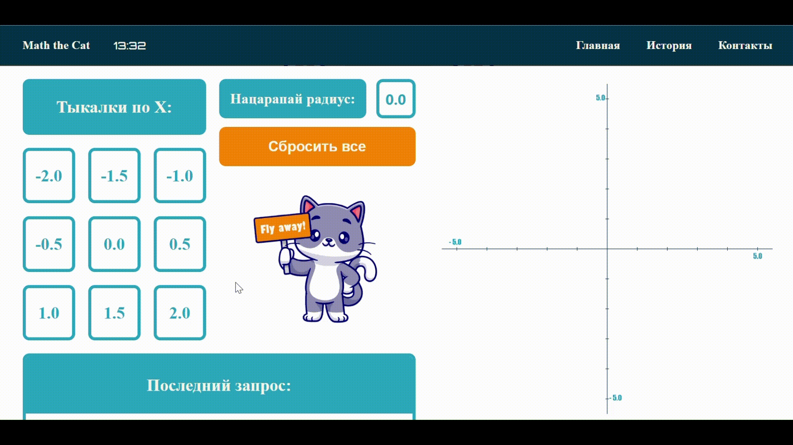
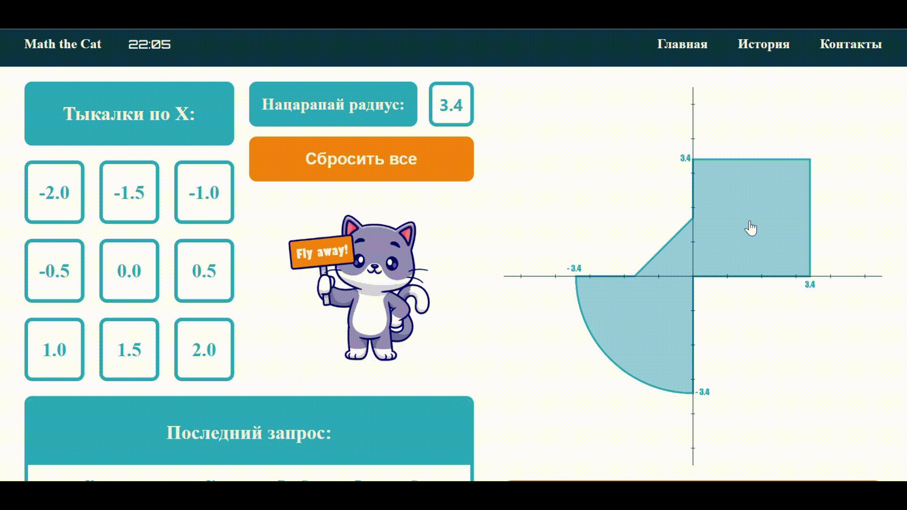
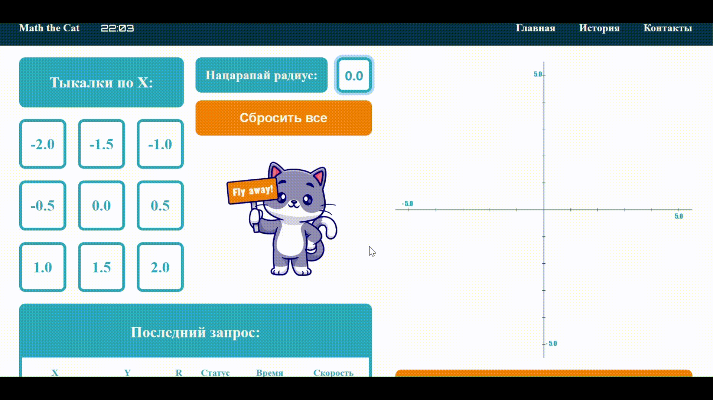

## Main information
**Math the Cat** is a web-application based on the JSF framework that allows user to get information about the point in the area using specific settings

All interactions and styles are implemented based on basic web development technologies
## Samples

<em>Home page</em>

<em>Parameter setting</em>

<em>Interactive area</em>

<em>Submissions tab</em>

<em>Error handling</em>

> [!IMPORTANT]
> Special thanks to [@catalyststuff](https://ru.freepik.com/author/catalyststuff) for cute paintings!